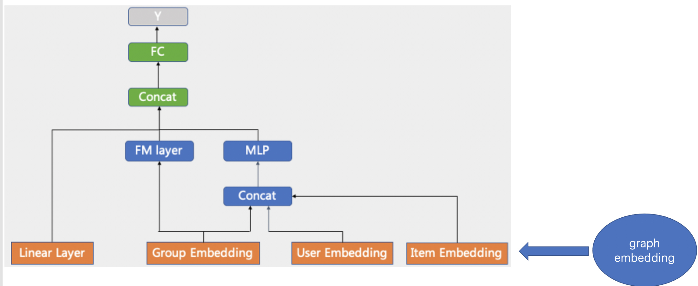

# BipartiteGraphDeepFM

## 模型介绍

BipartiteGraphDeepFM 是[GraphDeepFM](graph_deepfm.md)的改进模型，沿用了 GraphDeepFM 的基本框架，如下图所示。

## 模型网络结构

网络结构主要分成两部分，Graph 辅助网络和 CTR 主网络。

- Graph 辅助网络

  - 通常采用无监督的图卷积网络学习节点之间的相关性
  - 图由 user-item 的行为关系构建的，可以看做二部图
  - 具体的将 Graphsage 拓展为 BipartiteGraphsage, 对 user 和 item 使用了不同的 encoder

- CTR 为主网络

  - CTR 侧采用了 DeepFM 模型
  - 将图卷积网络得到的 user, item 的 embedding 和 group embdding concat 到一起作为 MLP 网络的输入
  - graph 侧和 CTR 侧共享 feature 层的 embedding, 有助于 embedding 空间的一致性，同时节省参数的存储空间

