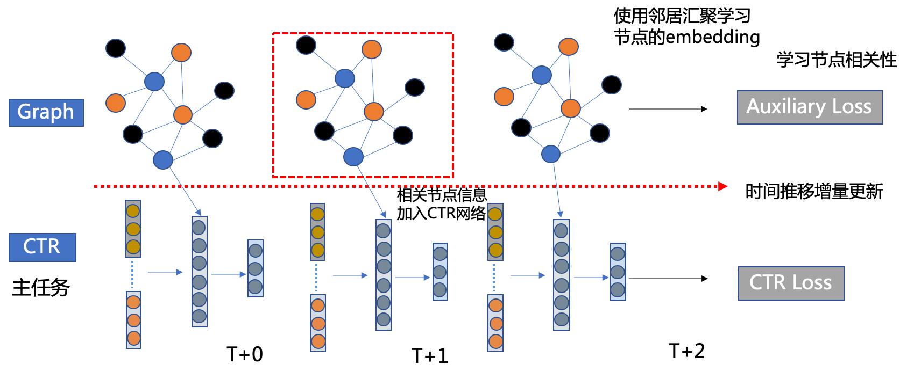
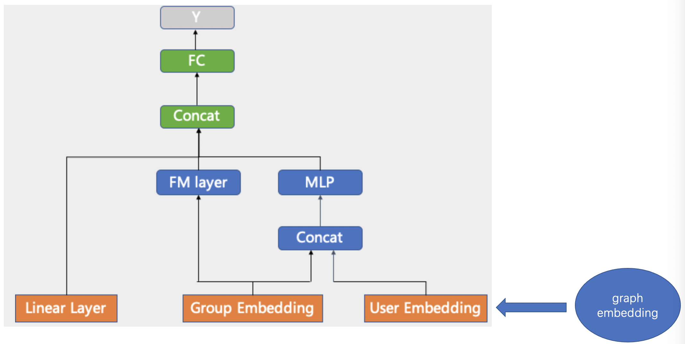

# GraphDeepFM

## 背景

- 长期以来，排序模型主要依赖用户画像和内容画像特征对 user-item 的点击概率进行建模
- 在微信的场景内，拥有很多可以刻画用户喜好的 user-item 关系的图信息
- 这些图关系信息的来源和分布差异较大，难以和现有的画像内容在同一个深度网络中共同建模

因此我们考虑在排序模型的基础上融合图模型去建模这些异构关系，GraphDeepFM 就是我们针对这一问题设计的模型。

## 模型介绍

下图展示了模型的主要结构

网络结构主要分成两部分，Graph 辅助网络和 CTR 主网络。

- Graph 辅助网络

  - 通常采用无监督的图卷积网络学习节点之间的相关性
  - 图由 user-item 的行为关系构建的，基于随机游走构造边
  - 对于 user 节点采用了 Graphsage 作为 Encoder, 对于 item 节点采用了 EmbeddingLookup 的方式

- CTR 为主网络

  - CTR 侧采用了 DeepFM 模型
  - 将图卷积网络得到的 user, item 的 embedding 和 group embdding concat 到一起作为 MLP 网络的输入
  - graph 侧和 CTR 侧共享 feature 层的 embedding, 有助于 embedding 空间的一致性，同时节省参数的存储空间

