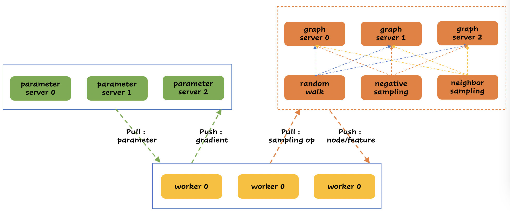

# 分布式使用必读

[TOC]

## 概述

### 支持的数据规模

- 图模型，支持 ***十亿级别节点，千亿级别边***
- 深度排序模型，支持 ***百亿级别特征，千亿级别样本***
- 深度召回模型，支持 ***百亿级别特征，千亿级别样本***

### 分布式训练或者预测 demo

包括 `训练脚本`、`预测脚本` 和 `demo 数据`，以下模型的 demo 都可以直接运行。

- [deepwalk](../demo/dist/run_deepwalk.sh)
- [eges](../demo/dist/run_eges.sh)
- [unsup_graphsage](../demo/dist/run_unsup_graphsage.sh)
- [unsup_bipartite_graphsage](../demo/dist/run_unsup_bipartite_graphsage.sh)
- [sup_graphsage](../demo/dist/run_sup_graphsage.sh)
- [contrastive_multi_view_learning](../demo/dist/run_contrastive_multi_view_learning.sh)
- [deep_graph_contrastive](../demo/dist/run_deep_graph_contrastive.sh)
- [deep_graph_infomax](../demo/dist/run_deep_graph_infomax.sh)

- [deepfm](../demo/dist/run_deepfm.sh)
- [deepfm2](../demo/dist/run_deepfm2.sh)
- [din](../demo/dist/run_din.sh)

- [youtube_dnn](../demo/dist/run_youtube_dnn.sh)
- [dssm](../demo/dist/run_dssm.sh)
- [graph_deepfm2](../demo/dist/run_graph_deepfm2.sh)
- [graph_dssm](../demo/dist/run_graph_dssm.sh)

### [数据格式](data_format.md)

### [参数格式](param.md)

---

## 流程简介

### 分布式架构图

分布式训练或者预测时，有三个角色，分别是 `graph server`、`parameter server` 和 `worker`。

- `graph server` 负责分布式图存储、查询等功能
- `parameter server` 负责存储、更新模型参数等功能
- `worker` 负责拉取远程数据、计算梯度等功能

### 分布式训练流程简介

- 启动 `graph_server`，从远程拉取数据加载，提供分布式数据存储和查询等功能
- 启动 `parameter_server`，参数初始化，提供存储、更新模型参数等功能
- 启动 `worker`，从 HDFS 拉取训练数据，提供计算梯度等功能

  - `worker` 与 `graph_server` 通信获取训练数据需要的节点，节点特征等信息
  - `worker` 与 `parameter_server` 通信获取训练数据需要的模型参数，计算梯度
  - `worker` 上传梯度到 `parameter_server`，`pamameter_server` 使用梯度更新参数

### 分布式预测流程简介

- 启动 `graph_server`，从远程拉取数据加载，提供分布式数据存储和查询等功能
- 启动 `parameter_server`，从远程加载模型信息
- 启动 `worker`，从 HDFS 拉取训练数据，预测结果

---

## 运行分布式 demo

### 编译 embedx

- 参考[编译](compile.md)文档编译

### 配置运行环境

- 要求 python3.6 或 python3.7 运行环境, 在 **embedx/demo** 目录下执行 `pip install -r requirements.txt`
- 修改 **embedx/demo/env.sh** 文件中的变量 **BUILD_DIR_ABS**

  - 将 **BUILD_DIR_ABS** 修改为 embedx 编译输出的 bin 文件路径 **embedx/build_xxxx**
    为 **用户的编译输出绝对路径**, 如

  - ***BUILD_DIR_ABS=/Users/yuanhangzou/embedx/build_xxxx***

以下以 `无监督图模型`、`有监督的图模型`、`深度排序模型` 和 `深度召回模型` 为例分别介绍如何分布式训练。

### 无监督图模型

- 模型概述

  - 无监督图模型包括`deepwalk`、`eges` 和 `unsup_graphsage` 等模型

- 以无监督 graphsage 模型为例，介绍无监督图模型的分布式训练流程

  - 进入到 `embedx/demo/dist` 目录，运行 `run_unsup_graphsage.sh` 脚本
  - 依次生成训练数据 `edge`、邻居平均特征 `average_feature`、模型 `model` 和 节点 embedding `embedding`

---

### 有监督图模型

- 模型概述

  - 有监督图模型包括 `sup_graphsage`
  - 有监督图模型提供了 `多标签` 和 `多分类` 功能

- 以 `有监督 graphsage 模型多分类` 为例，介绍有监督图模型的分布式训练流程

  - 进入到 `embedx/demo/dist` 目录，运行 `run_sup_graphsage.sh` 脚本
  - 依次生成邻居平均特征 `average_feature`、模型 `model` 和 节点 embedding `embedding`

---

### 深度排序模型

- 模型概述

  - 深度排序模型包括 `deepfm` 和 `din` 等模型

- 以`deepfm 模型`为例，介绍深度排序模型的分布式训练流程

  - 进入到 `embedx/demo/dist` 目录，运行 `run_deepfm.sh` 脚本
  - 依次生成模型 `model` 和 样本打分结果 `probs`

---

### 深度召回模型

- 模型概述

  - 深度召回模型包括 `dssm` 和 `youtube_dnn` 模型

- 以`dssm 模型`为例，介绍深度召回模型的分布式训练流程

  - 进入到 `embedx/demo/dist` 目录，运行 `run_dssm.sh` 脚本
  - 依次生成模型 `model`、user\_embedding `user_embedding` 和 item\_embedding `item_embedding`
